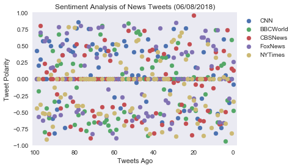
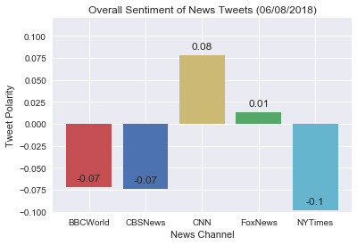

# Analysis
- BBCWorld, CBSNews and NYTimes has the most negative Vader sentiment analysis.
- CNN and FoxNews has an overall positive Vader scores.CNN has the highest score with 0.08,the FoxNews has 0.01.
- The New York Times has a negative score of -0.1. Even though its score is negative, the New York Times had the scores closes to zero. It has the news mood with the closest neutral sentiment.
- The Vader analysis on news channels is highly dependent on they type of news happens on a particular day. A more fair analysis would analyze a larger sample of tweets over a larger period of time.


```python
# Dependencies
import tweepy
import numpy as np
import pandas as pd
import matplotlib.pyplot as plt
import seaborn as sns

# Import and Initialize Sentiment Analyzer
from vaderSentiment.vaderSentiment import SentimentIntensityAnalyzer
analyzer = SentimentIntensityAnalyzer()

# Twitter API Keys
from config import (consumer_key, 
                    consumer_secret, 
                    access_token, 
                    access_token_secret)

# Setup Tweepy API Authentication
auth = tweepy.OAuthHandler(consumer_key, consumer_secret)
auth.set_access_token(access_token, access_token_secret)
api = tweepy.API(auth, parser=tweepy.parsers.JSONParser())
```


```python
# Target Search Term
target_terms = ("CNN","BBCWorld","CBSNews","FoxNews","NYTimes")

# List to hold results
results_list = []

# Loop through all target users
for target in target_terms:
    
    count = 0

    # Run search around each tweet
    public_tweets = api.user_timeline(target, count=100)

        # Loop through all tweets
    for tweet in public_tweets:
            
        # Run Vader Analysis on each tweet
        results = analyzer.polarity_scores(tweet["text"])
        compound = results["compound"]
        pos = results["pos"]
        neu = results["neu"]
        neg = results["neg"]
        tweets_ago = count
        tweet_text = tweet["text"]
            
        # Append news results to 'results_list'
        results_list.append({"User":target,
                        "Date": tweet['created_at'],
                        "Compound" : compound,
                        "Positive" : pos,
                        "Negative" : neg,
                        "Neutral" : neu,
                        "Tweets Ago" : count,
                        "Tweet Text" : tweet_text})
        count= count+ 1
        
```


```python
news_df = pd.DataFrame.from_dict(results_list)#.set_index("User").round(3)
news_df
```


<div>
<style scoped>
    .dataframe tbody tr th:only-of-type {
        vertical-align: middle;
    }

    .dataframe tbody tr th {
        vertical-align: top;
    }

    .dataframe thead th {
        text-align: right;
    }
</style>
<table border="1" class="dataframe">
  <thead>
    <tr style="text-align: right;">
      <th></th>
      <th>Compound</th>
      <th>Date</th>
      <th>Negative</th>
      <th>Neutral</th>
      <th>Positive</th>
      <th>Tweet Text</th>
      <th>Tweets Ago</th>
      <th>User</th>
    </tr>
  </thead>
  <tbody>
    <tr>
      <th>0</th>
      <td>-0.0813</td>
      <td>Fri Jun 08 14:30:16 +0000 2018</td>
      <td>0.110</td>
      <td>0.794</td>
      <td>0.096</td>
      <td>President Trump says he doesn't disagree with ...</td>
      <td>0</td>
      <td>CNN</td>
    </tr>
    <tr>
      <th>1</th>
      <td>0.0000</td>
      <td>Fri Jun 08 14:20:11 +0000 2018</td>
      <td>0.000</td>
      <td>1.000</td>
      <td>0.000</td>
      <td>Former NBA star Dennis Rodman is traveling to ...</td>
      <td>1</td>
      <td>CNN</td>
    </tr>
    <tr>
      <th>2</th>
      <td>-0.3597</td>
      <td>Fri Jun 08 14:10:04 +0000 2018</td>
      <td>0.146</td>
      <td>0.773</td>
      <td>0.082</td>
      <td>Venezuela ranks as the most dangerous country ...</td>
      <td>2</td>
      <td>CNN</td>
    </tr>
    <tr>
      <th>3</th>
      <td>0.0000</td>
      <td>Fri Jun 08 14:00:06 +0000 2018</td>
      <td>0.000</td>
      <td>1.000</td>
      <td>0.000</td>
      <td>Anthony Bourdain, the chef and gifted storytel...</td>
      <td>3</td>
      <td>CNN</td>
    </tr>
    <tr>
      <th>4</th>
      <td>0.0516</td>
      <td>Fri Jun 08 13:50:09 +0000 2018</td>
      <td>0.000</td>
      <td>0.938</td>
      <td>0.062</td>
      <td>The "gig economy" of freelancers and short-ter...</td>
      <td>4</td>
      <td>CNN</td>
    </tr>
    <tr>
      <th>5</th>
      <td>0.5994</td>
      <td>Fri Jun 08 13:40:07 +0000 2018</td>
      <td>0.000</td>
      <td>0.803</td>
      <td>0.197</td>
      <td>"It concerns me that so many voices within the...</td>
      <td>5</td>
      <td>CNN</td>
    </tr>
    <tr>
      <th>6</th>
      <td>-0.7351</td>
      <td>Fri Jun 08 13:30:06 +0000 2018</td>
      <td>0.267</td>
      <td>0.733</td>
      <td>0.000</td>
      <td>Federal investigators say in a preliminary rep...</td>
      <td>6</td>
      <td>CNN</td>
    </tr>
    <tr>
      <th>7</th>
      <td>0.0000</td>
      <td>Fri Jun 08 13:20:05 +0000 2018</td>
      <td>0.000</td>
      <td>1.000</td>
      <td>0.000</td>
      <td>President Trump says he wants to meet with NFL...</td>
      <td>7</td>
      <td>CNN</td>
    </tr>
    <tr>
      <th>8</th>
      <td>-0.5267</td>
      <td>Fri Jun 08 13:12:07 +0000 2018</td>
      <td>0.145</td>
      <td>0.855</td>
      <td>0.000</td>
      <td>A 25-year-old South Korean hiker is recovering...</td>
      <td>8</td>
      <td>CNN</td>
    </tr>
    <tr>
      <th>9</th>
      <td>-0.8225</td>
      <td>Fri Jun 08 13:04:02 +0000 2018</td>
      <td>0.336</td>
      <td>0.664</td>
      <td>0.000</td>
      <td>A longtime US Senate staffer was arrested on c...</td>
      <td>9</td>
      <td>CNN</td>
    </tr>
    <tr>
      <th>10</th>
      <td>0.0516</td>
      <td>Fri Jun 08 12:59:08 +0000 2018</td>
      <td>0.000</td>
      <td>0.938</td>
      <td>0.062</td>
      <td>Stormy Daniels' attorney Michael Avenatti says...</td>
      <td>10</td>
      <td>CNN</td>
    </tr>
    <tr>
      <th>11</th>
      <td>0.0000</td>
      <td>Fri Jun 08 12:57:07 +0000 2018</td>
      <td>0.000</td>
      <td>1.000</td>
      <td>0.000</td>
      <td>Time cover gets Trump just right | By Michael ...</td>
      <td>11</td>
      <td>CNN</td>
    </tr>
    <tr>
      <th>12</th>
      <td>-0.4767</td>
      <td>Fri Jun 08 12:55:43 +0000 2018</td>
      <td>0.134</td>
      <td>0.866</td>
      <td>0.000</td>
      <td>President Trump says Russia should be reinstat...</td>
      <td>12</td>
      <td>CNN</td>
    </tr>
    <tr>
      <th>13</th>
      <td>0.5719</td>
      <td>Fri Jun 08 12:54:50 +0000 2018</td>
      <td>0.000</td>
      <td>0.821</td>
      <td>0.179</td>
      <td>A new television ad showing a gubernatorial ca...</td>
      <td>13</td>
      <td>CNN</td>
    </tr>
    <tr>
      <th>14</th>
      <td>0.0000</td>
      <td>Fri Jun 08 12:52:04 +0000 2018</td>
      <td>0.000</td>
      <td>1.000</td>
      <td>0.000</td>
      <td>FX renews "Atlanta" for Season 3 https://t.co/...</td>
      <td>14</td>
      <td>CNN</td>
    </tr>
    <tr>
      <th>15</th>
      <td>0.4019</td>
      <td>Fri Jun 08 12:50:09 +0000 2018</td>
      <td>0.000</td>
      <td>0.870</td>
      <td>0.130</td>
      <td>JUST IN: President Trump says he is considerin...</td>
      <td>15</td>
      <td>CNN</td>
    </tr>
    <tr>
      <th>16</th>
      <td>-0.2960</td>
      <td>Fri Jun 08 12:45:00 +0000 2018</td>
      <td>0.217</td>
      <td>0.664</td>
      <td>0.119</td>
      <td>Krill are critical to the fight against climat...</td>
      <td>16</td>
      <td>CNN</td>
    </tr>
    <tr>
      <th>17</th>
      <td>-0.7351</td>
      <td>Fri Jun 08 12:43:06 +0000 2018</td>
      <td>0.279</td>
      <td>0.721</td>
      <td>0.000</td>
      <td>In a preliminary report about a fatal Tesla cr...</td>
      <td>17</td>
      <td>CNN</td>
    </tr>
    <tr>
      <th>18</th>
      <td>-0.5994</td>
      <td>Fri Jun 08 12:38:42 +0000 2018</td>
      <td>0.242</td>
      <td>0.659</td>
      <td>0.099</td>
      <td>If you or someone you know might be at risk of...</td>
      <td>18</td>
      <td>CNN</td>
    </tr>
    <tr>
      <th>19</th>
      <td>0.1779</td>
      <td>Fri Jun 08 12:37:04 +0000 2018</td>
      <td>0.124</td>
      <td>0.723</td>
      <td>0.153</td>
      <td>The Washington Capitals defeated the Vegas Gol...</td>
      <td>19</td>
      <td>CNN</td>
    </tr>
    <tr>
      <th>20</th>
      <td>0.0000</td>
      <td>Fri Jun 08 12:31:06 +0000 2018</td>
      <td>0.000</td>
      <td>1.000</td>
      <td>0.000</td>
      <td>For almost two-and-a-half hours, Democratic me...</td>
      <td>20</td>
      <td>CNN</td>
    </tr>
    <tr>
      <th>21</th>
      <td>0.0000</td>
      <td>Fri Jun 08 12:26:05 +0000 2018</td>
      <td>0.000</td>
      <td>1.000</td>
      <td>0.000</td>
      <td>In the Maldives, a resort offers endangered se...</td>
      <td>21</td>
      <td>CNN</td>
    </tr>
    <tr>
      <th>22</th>
      <td>0.0000</td>
      <td>Fri Jun 08 12:21:08 +0000 2018</td>
      <td>0.000</td>
      <td>1.000</td>
      <td>0.000</td>
      <td>The office of Arizona Republican Rep. Martha M...</td>
      <td>22</td>
      <td>CNN</td>
    </tr>
    <tr>
      <th>23</th>
      <td>0.0000</td>
      <td>Fri Jun 08 12:20:10 +0000 2018</td>
      <td>0.000</td>
      <td>1.000</td>
      <td>0.000</td>
      <td>KFC says it will break with its meat-loving tr...</td>
      <td>23</td>
      <td>CNN</td>
    </tr>
    <tr>
      <th>24</th>
      <td>0.7650</td>
      <td>Fri Jun 08 12:16:05 +0000 2018</td>
      <td>0.145</td>
      <td>0.526</td>
      <td>0.329</td>
      <td>The race to save the Great Barrier Reef? A cor...</td>
      <td>24</td>
      <td>CNN</td>
    </tr>
    <tr>
      <th>25</th>
      <td>-0.4767</td>
      <td>Fri Jun 08 12:15:05 +0000 2018</td>
      <td>0.162</td>
      <td>0.838</td>
      <td>0.000</td>
      <td>President Trump says he looks forward to 'stra...</td>
      <td>25</td>
      <td>CNN</td>
    </tr>
    <tr>
      <th>26</th>
      <td>0.0000</td>
      <td>Fri Jun 08 12:12:03 +0000 2018</td>
      <td>0.000</td>
      <td>1.000</td>
      <td>0.000</td>
      <td>The Trump administration has announced a new, ...</td>
      <td>26</td>
      <td>CNN</td>
    </tr>
    <tr>
      <th>27</th>
      <td>0.0000</td>
      <td>Fri Jun 08 12:06:04 +0000 2018</td>
      <td>0.000</td>
      <td>1.000</td>
      <td>0.000</td>
      <td>Republican patience is waning when it comes to...</td>
      <td>27</td>
      <td>CNN</td>
    </tr>
    <tr>
      <th>28</th>
      <td>-0.5859</td>
      <td>Fri Jun 08 11:58:07 +0000 2018</td>
      <td>0.211</td>
      <td>0.789</td>
      <td>0.000</td>
      <td>Police are investigating the London Fire Briga...</td>
      <td>28</td>
      <td>CNN</td>
    </tr>
    <tr>
      <th>29</th>
      <td>0.0000</td>
      <td>Fri Jun 08 11:52:03 +0000 2018</td>
      <td>0.000</td>
      <td>1.000</td>
      <td>0.000</td>
      <td>A group of Republicans went to the White House...</td>
      <td>29</td>
      <td>CNN</td>
    </tr>
    <tr>
      <th>...</th>
      <td>...</td>
      <td>...</td>
      <td>...</td>
      <td>...</td>
      <td>...</td>
      <td>...</td>
      <td>...</td>
      <td>...</td>
    </tr>
    <tr>
      <th>470</th>
      <td>0.0000</td>
      <td>Thu Jun 07 22:47:03 +0000 2018</td>
      <td>0.000</td>
      <td>1.000</td>
      <td>0.000</td>
      <td>Evening Briefing: Here's what you need to know...</td>
      <td>70</td>
      <td>NYTimes</td>
    </tr>
    <tr>
      <th>471</th>
      <td>0.0000</td>
      <td>Thu Jun 07 22:32:06 +0000 2018</td>
      <td>0.074</td>
      <td>0.851</td>
      <td>0.074</td>
      <td>Half-price MetroCards for low-income New Yorke...</td>
      <td>71</td>
      <td>NYTimes</td>
    </tr>
    <tr>
      <th>472</th>
      <td>0.0000</td>
      <td>Thu Jun 07 22:17:02 +0000 2018</td>
      <td>0.000</td>
      <td>1.000</td>
      <td>0.000</td>
      <td>RT @EricLiptonNYT: Been writing a lot re Pruit...</td>
      <td>72</td>
      <td>NYTimes</td>
    </tr>
    <tr>
      <th>473</th>
      <td>0.0000</td>
      <td>Thu Jun 07 22:06:07 +0000 2018</td>
      <td>0.000</td>
      <td>1.000</td>
      <td>0.000</td>
      <td>We found a trove of secret documents after Mos...</td>
      <td>73</td>
      <td>NYTimes</td>
    </tr>
    <tr>
      <th>474</th>
      <td>0.0000</td>
      <td>Thu Jun 07 21:56:02 +0000 2018</td>
      <td>0.000</td>
      <td>1.000</td>
      <td>0.000</td>
      <td>A 4-ingredient, 5-star roast chicken recipe ht...</td>
      <td>74</td>
      <td>NYTimes</td>
    </tr>
    <tr>
      <th>475</th>
      <td>0.0000</td>
      <td>Thu Jun 07 21:46:02 +0000 2018</td>
      <td>0.000</td>
      <td>1.000</td>
      <td>0.000</td>
      <td>This weekend, get thee to Shakespeare in the P...</td>
      <td>75</td>
      <td>NYTimes</td>
    </tr>
    <tr>
      <th>476</th>
      <td>-0.4019</td>
      <td>Thu Jun 07 21:30:16 +0000 2018</td>
      <td>0.137</td>
      <td>0.863</td>
      <td>0.000</td>
      <td>The Twitter habits of a sports executive’s wif...</td>
      <td>76</td>
      <td>NYTimes</td>
    </tr>
    <tr>
      <th>477</th>
      <td>0.0000</td>
      <td>Thu Jun 07 21:15:07 +0000 2018</td>
      <td>0.000</td>
      <td>1.000</td>
      <td>0.000</td>
      <td>“We should do more and talk less.” That was th...</td>
      <td>77</td>
      <td>NYTimes</td>
    </tr>
    <tr>
      <th>478</th>
      <td>-0.4019</td>
      <td>Thu Jun 07 21:01:05 +0000 2018</td>
      <td>0.130</td>
      <td>0.870</td>
      <td>0.000</td>
      <td>RT @TheSteinLine: .@StephenCurry30 insists on ...</td>
      <td>78</td>
      <td>NYTimes</td>
    </tr>
    <tr>
      <th>479</th>
      <td>-0.4019</td>
      <td>Thu Jun 07 20:45:04 +0000 2018</td>
      <td>0.114</td>
      <td>0.886</td>
      <td>0.000</td>
      <td>Is Glen Buchenbach a rare Scotch? Nope. It's m...</td>
      <td>79</td>
      <td>NYTimes</td>
    </tr>
    <tr>
      <th>480</th>
      <td>0.7717</td>
      <td>Thu Jun 07 20:32:24 +0000 2018</td>
      <td>0.000</td>
      <td>0.774</td>
      <td>0.226</td>
      <td>RT @tannercurtis: The New York issue of @NYTma...</td>
      <td>80</td>
      <td>NYTimes</td>
    </tr>
    <tr>
      <th>481</th>
      <td>0.1189</td>
      <td>Thu Jun 07 20:30:05 +0000 2018</td>
      <td>0.169</td>
      <td>0.563</td>
      <td>0.268</td>
      <td>More and more, politicians in competitive race...</td>
      <td>81</td>
      <td>NYTimes</td>
    </tr>
    <tr>
      <th>482</th>
      <td>0.0000</td>
      <td>Thu Jun 07 20:15:06 +0000 2018</td>
      <td>0.000</td>
      <td>1.000</td>
      <td>0.000</td>
      <td>The New Jersey Legislature voted to legalize s...</td>
      <td>82</td>
      <td>NYTimes</td>
    </tr>
    <tr>
      <th>483</th>
      <td>0.7783</td>
      <td>Thu Jun 07 20:07:02 +0000 2018</td>
      <td>0.000</td>
      <td>0.764</td>
      <td>0.236</td>
      <td>RT @MichaelPaulson: Who will win the big prize...</td>
      <td>83</td>
      <td>NYTimes</td>
    </tr>
    <tr>
      <th>484</th>
      <td>0.0762</td>
      <td>Thu Jun 07 20:00:21 +0000 2018</td>
      <td>0.000</td>
      <td>0.939</td>
      <td>0.061</td>
      <td>Couples do not pay for their wedding announcem...</td>
      <td>84</td>
      <td>NYTimes</td>
    </tr>
    <tr>
      <th>485</th>
      <td>-0.2263</td>
      <td>Thu Jun 07 19:53:08 +0000 2018</td>
      <td>0.112</td>
      <td>0.888</td>
      <td>0.000</td>
      <td>RT @kchangnyt: Life not discovered on Mars. Bu...</td>
      <td>85</td>
      <td>NYTimes</td>
    </tr>
    <tr>
      <th>486</th>
      <td>0.0000</td>
      <td>Thu Jun 07 19:45:07 +0000 2018</td>
      <td>0.000</td>
      <td>1.000</td>
      <td>0.000</td>
      <td>Almost all mammals experience REM sleep, but e...</td>
      <td>86</td>
      <td>NYTimes</td>
    </tr>
    <tr>
      <th>487</th>
      <td>-0.2716</td>
      <td>Thu Jun 07 19:30:11 +0000 2018</td>
      <td>0.162</td>
      <td>0.838</td>
      <td>0.000</td>
      <td>Delta is the latest carrier to warn that fligh...</td>
      <td>87</td>
      <td>NYTimes</td>
    </tr>
    <tr>
      <th>488</th>
      <td>0.2732</td>
      <td>Thu Jun 07 19:30:06 +0000 2018</td>
      <td>0.090</td>
      <td>0.769</td>
      <td>0.140</td>
      <td>Google, reeling from an employee protest over ...</td>
      <td>88</td>
      <td>NYTimes</td>
    </tr>
    <tr>
      <th>489</th>
      <td>0.0000</td>
      <td>Thu Jun 07 19:15:05 +0000 2018</td>
      <td>0.000</td>
      <td>1.000</td>
      <td>0.000</td>
      <td>Democrats appear set to test whether conventio...</td>
      <td>89</td>
      <td>NYTimes</td>
    </tr>
    <tr>
      <th>490</th>
      <td>-0.1280</td>
      <td>Thu Jun 07 19:03:01 +0000 2018</td>
      <td>0.067</td>
      <td>0.933</td>
      <td>0.000</td>
      <td>RT @nytimesbusiness: Look to Iowa's vast acres...</td>
      <td>90</td>
      <td>NYTimes</td>
    </tr>
    <tr>
      <th>491</th>
      <td>-0.7181</td>
      <td>Thu Jun 07 19:00:07 +0000 2018</td>
      <td>0.240</td>
      <td>0.760</td>
      <td>0.000</td>
      <td>"E-scooters might look and feel kind of dorky,...</td>
      <td>91</td>
      <td>NYTimes</td>
    </tr>
    <tr>
      <th>492</th>
      <td>0.0624</td>
      <td>Thu Jun 07 18:45:04 +0000 2018</td>
      <td>0.109</td>
      <td>0.771</td>
      <td>0.120</td>
      <td>The judge could not help himself. He used term...</td>
      <td>92</td>
      <td>NYTimes</td>
    </tr>
    <tr>
      <th>493</th>
      <td>-0.5267</td>
      <td>Thu Jun 07 18:40:01 +0000 2018</td>
      <td>0.159</td>
      <td>0.841</td>
      <td>0.000</td>
      <td>An internal White House analysis of President ...</td>
      <td>93</td>
      <td>NYTimes</td>
    </tr>
    <tr>
      <th>494</th>
      <td>-0.9081</td>
      <td>Thu Jun 07 18:30:04 +0000 2018</td>
      <td>0.388</td>
      <td>0.612</td>
      <td>0.000</td>
      <td>While evil clowns and serial killers at sorori...</td>
      <td>94</td>
      <td>NYTimes</td>
    </tr>
    <tr>
      <th>495</th>
      <td>-0.5267</td>
      <td>Thu Jun 07 18:22:35 +0000 2018</td>
      <td>0.167</td>
      <td>0.833</td>
      <td>0.000</td>
      <td>RT @nytimesarts: A lost John Coltrane recordin...</td>
      <td>95</td>
      <td>NYTimes</td>
    </tr>
    <tr>
      <th>496</th>
      <td>-0.5106</td>
      <td>Thu Jun 07 18:15:02 +0000 2018</td>
      <td>0.125</td>
      <td>0.875</td>
      <td>0.000</td>
      <td>Liz and Dick Uihlein are spending big to sway ...</td>
      <td>96</td>
      <td>NYTimes</td>
    </tr>
    <tr>
      <th>497</th>
      <td>-0.3818</td>
      <td>Thu Jun 07 18:00:14 +0000 2018</td>
      <td>0.126</td>
      <td>0.874</td>
      <td>0.000</td>
      <td>Kate Spade came from the sort of modest beginn...</td>
      <td>97</td>
      <td>NYTimes</td>
    </tr>
    <tr>
      <th>498</th>
      <td>0.0000</td>
      <td>Thu Jun 07 17:58:05 +0000 2018</td>
      <td>0.000</td>
      <td>1.000</td>
      <td>0.000</td>
      <td>G-7 meetings are usually moments of camaraderi...</td>
      <td>98</td>
      <td>NYTimes</td>
    </tr>
    <tr>
      <th>499</th>
      <td>-0.4404</td>
      <td>Thu Jun 07 17:45:11 +0000 2018</td>
      <td>0.127</td>
      <td>0.873</td>
      <td>0.000</td>
      <td>When José, 5,  landed in Michigan, all he carr...</td>
      <td>99</td>
      <td>NYTimes</td>
    </tr>
  </tbody>
</table>
<p>500 rows × 8 columns</p>
</div>


```python
news_df.to_csv("Twitter_News_Mood.csv", index=False)
```


```python
#plot scatterplot using a for loop.
#sns.set(color_codes=True)

for target in target_terms:
    df = news_df.loc[news_df["User"] == target]
    plt.scatter(df["Tweets Ago"],df["Compound"],label = target)
    
# adding y limit and x limit
plt.xlim(101,-2)
plt.ylim(-1,1)
    
#Add legend
plt.legend(bbox_to_anchor = (1,1))

#Add title, x axis label, and y axis label.
plt.title("Sentiment Analysis of News Tweets (06/08/2018)")
plt.xlabel("Tweets Ago")
plt.ylabel("Tweet Polarity")


#Set a grid on the plot.
plt.grid()

plt.savefig("Sentiment Analysis of News Tweets")
plt.show()
```





```python
average_sentiment = news_df.groupby("User")["Compound"].mean()
average_sentiment
```


    User
    BBCWorld   -0.072110
    CBSNews    -0.073402
    CNN         0.078002
    FoxNews     0.013268
    NYTimes    -0.097817
    Name: Compound, dtype: float64


```python
# plotting graph
x_axis = np.arange(len(average_sentiment))
xlabels = average_sentiment.index
count = 0
for sentiment in average_sentiment:
    plt.text(count, sentiment+.01, str(round(sentiment,2)), ha = 'center', va = 'center')
    count = count + 1
plt.bar(x_axis, average_sentiment, tick_label = xlabels, color = ['r', 'b', 'y', 'g', 'c'])
#Set title, x axis label, and y axis label.
plt.ylim(-.1,.12)
plt.title("Overall Sentiment of News Tweets (06/08/2018)")
plt.xlabel("News Channel")
plt.ylabel("Tweet Polarity")
plt.savefig("Overall Sentiment of News Tweets")
plt.show()
```




